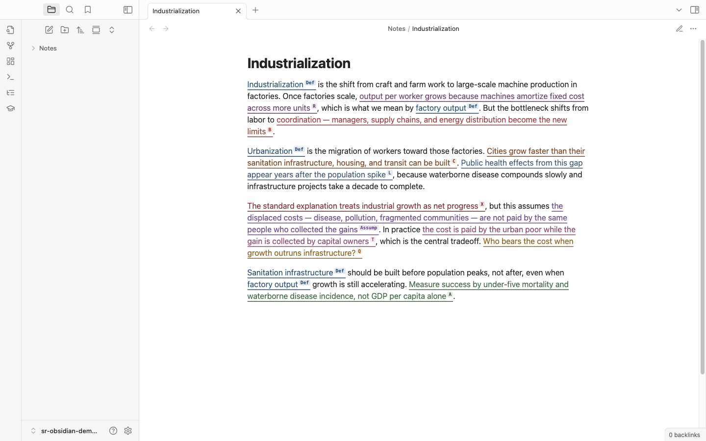
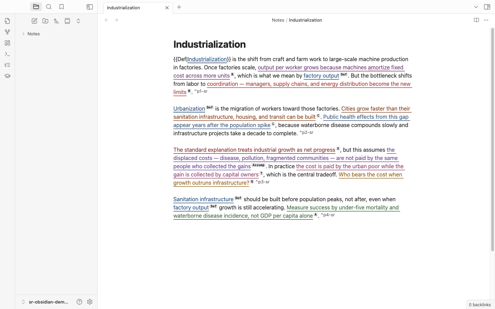
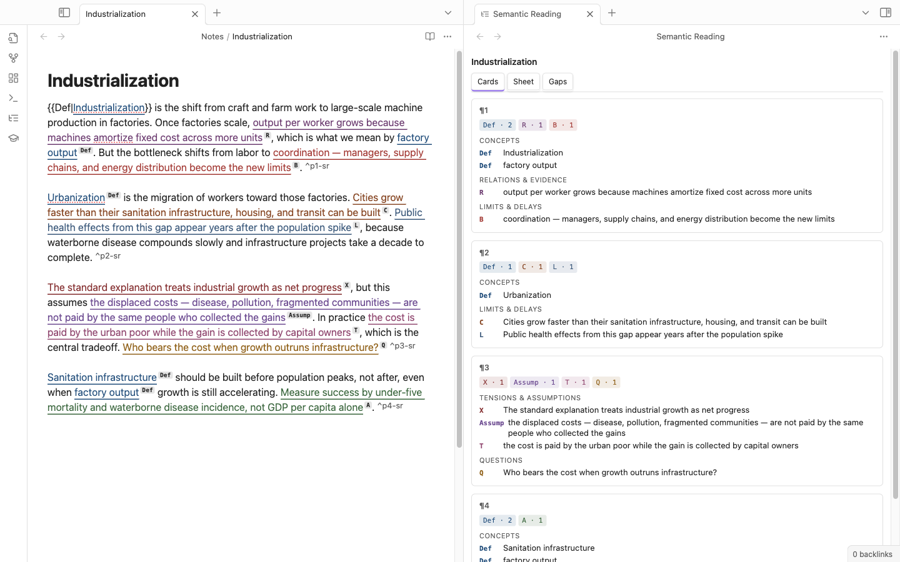
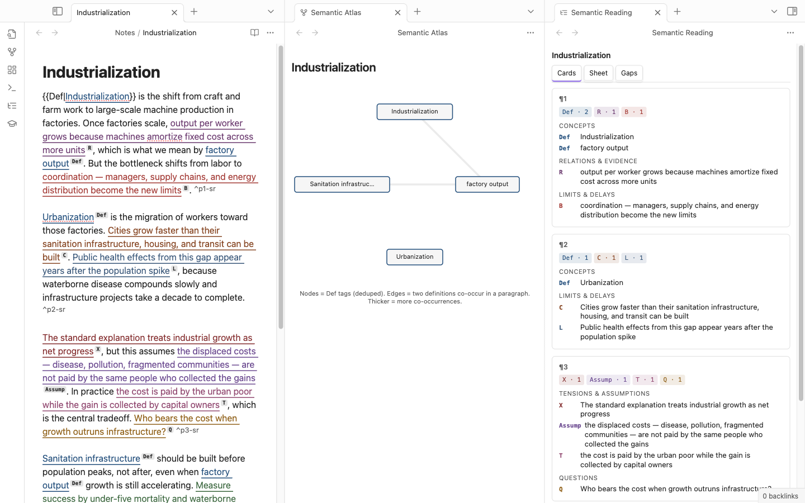
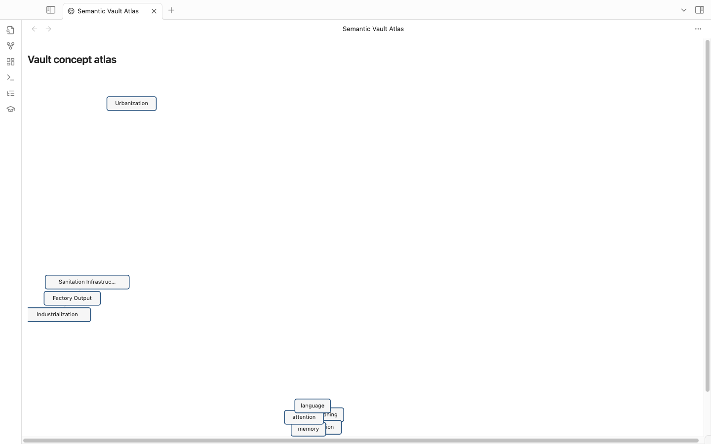
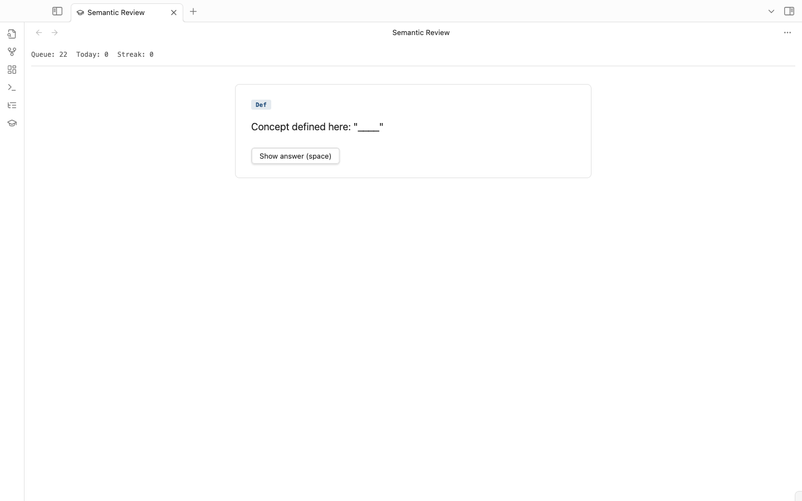
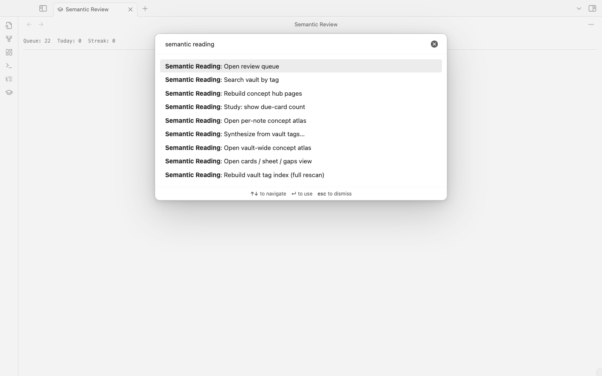
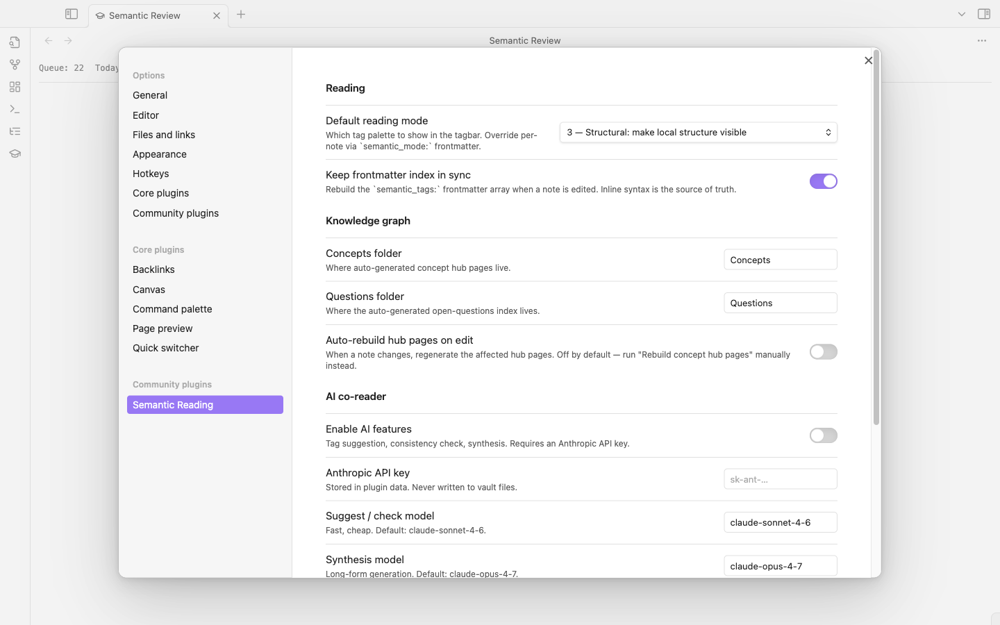

# Semantic Reading for Obsidian

Mark prose with semantic sigils — **Def**, **R**, **Q**, **A**, **M**, and 14 others across 4 families — to capture the *structural role* each span plays in an argument. Then turn those tags into a vault-wide knowledge graph, a spaced-repetition queue, and AI-synthesized study guides and outlines.

A reading-to-knowledge-to-writing loop, all inside Obsidian.



---

## Install via BRAT (recommended for now)

This plugin is not yet in the official community-plugins list. Use [BRAT](https://github.com/TfTHacker/obsidian42-brat) to install it from this repo:

1. Install **BRAT** from the community plugins browser and enable it.
2. `Cmd-P → BRAT: Add a beta plugin for testing`.
3. Paste: `DavidTbilisi/obsidian-semantic-reading`.
4. Click **Add Plugin**. BRAT fetches the latest release.
5. Settings → Community plugins → enable **Semantic Reading**.

BRAT will auto-update the plugin whenever a new release is cut.

---

## What it does

### 1. MARK — tag prose with sigils

Select text in any note. A floating tagbar appears. Press a letter (`d`=Def, `r`=R, `q`=Q, `a`=A, `m`=M, etc.) or click the sigil. The selection is wrapped in inline `{{Def|cognition}}` syntax and rendered as a colored span with a superscript label in both Live Preview and Reading mode.



**Modes** (1–5) control which tags are available — Easy surfaces obvious anchors, Structural makes local structure visible, Regenerative exposes the whole 19-tag palette. Per-note override via `semantic_mode: 5` in frontmatter.

### 2. KNOW — vault-wide knowledge graph

- **Cards / Sheet / Gaps** side view — per-note inventory of tagged spans, grouped by semantic family.

  

- **Per-note Atlas** — SVG concept graph of `Def` tags in the current note.

  

- **Vault-wide Atlas** — force-directed graph of every `Def` across the vault. Click a node to open its hub page.

  

- **Concept hub pages** — auto-generated `Concepts/<name>.md` aggregating every definition of a concept across all notes. Backlinks panel and graph view light up for free.
- **Search by tag** — quick-switcher modal (`Cmd-P → Search vault by tag`): type `Q ` for every open question, `Def cog` to fuzzy-match concepts.

### 3. REMEMBER — built-in spaced repetition

- **Review queue** (`Cmd-P → Open review queue`) — full-pane study UI. Space to flip, 1–4 to rate. FSRS-v5 scheduler (vendored, no native deps).
- Tagged `Def` spans become cloze cards. `Q` spans become recall cards. Opt-in per tag.
- Streak + daily counter tracked in plugin data.



### 4. MAKE — AI synthesis from tags

`Cmd-P → Synthesize from vault tags…` opens a template picker:

- **Outline** — `Def → R → Ev` chains for a concept
- **Steelman** — `T / X / Opp / Assump` surfaced from the vault
- **Study guide** — `Q + A + M` formatted as exam prep
- **Briefing** — `N / D / P + key Defs + Q` as a one-pager
- **Reading agenda** — global open `Q`s ranked

The slice fed to the LLM is shown to you before the call. Output lands in `Synthesis/` with full provenance — every claim links back to the source paragraph.

Every plugin entry-point lives under one prefix in the command palette:



### Exports (no AI required)

- **Annotated markdown** — full note with tag extracts grouped by family.
- **Anki CSV per framework** — one CSV per encoding framework (NEDF, CAST, SPEAR, HEART, ORACLE), Anki "Basic" note-type compatible.

---

## Privacy and network use

The plugin works fully offline **except** for the AI features (suggest, check, synthesize), which are off by default. When enabled:

- All AI calls go to **api.anthropic.com** using your Anthropic API key.
- Your API key is stored in this plugin's `data.json` (inside the vault's `.obsidian/plugins/` folder). It is **not** written to any vault note.
- Each call sends: the tag schema (cached system prompt), the active paragraph (for suggest) or the slice you previewed (for synthesize). Note contents outside that slice are never sent.
- No telemetry. No third-party analytics. No background traffic.

To disable all network use, leave "Enable AI features" off in settings.

---

## Inline syntax reference

```
{{Tag|text}}                       # tagged span
{{Tag|text|note=annotation}}       # with attached note
{{Tag|[[Concepts/cognition]]}}     # tagged wikilink (Def → hub page)
{{Tag|[[Concepts/cognition|cognition]]}}  # explicit display
```

The `{{…}}` delimiters are chosen to avoid collisions with native Obsidian syntax (`==highlight==`, `[[wikilink]]`, Dataview `key:: value`).

---

## Tag taxonomy

| Family | Tags |
|---|---|
| Anchor | `N` (Name), `D` (Date), `P` (Place) |
| Meaning | `Def` (Definition), `Mn`, `Ex`, `An`, `Q` (Question) |
| Structure | `R` (Relation), `Ev`, `C` (Constraint), `B` (Bottleneck), `L` (Delay), `T` (Tradeoff), `X` (Tension), `Opp`, `Assump` |
| Execution | `A` (Action), `M` (Measure) |

Each tag routes downstream to one of the Neural OS encoding frameworks (NEDF, CAST, SPEAR, HEART, ORACLE), which is what the Anki CSV export uses.

---

## Settings

- **Default reading mode** — controls the tagbar palette.
- **Keep frontmatter index in sync** — rebuild `semantic_tags:` on save (inline is always source of truth).
- **Auto-rebuild hub pages on edit** — off by default. Run "Rebuild concept hub pages" manually instead, or toggle on.
- **AI co-reader** — enable, API key, model selection.
- **Synthesis output folder** — default `Synthesis/`.



---

## Keyboard shortcuts (when active)

| Key | Action |
|---|---|
| Letter (`d`, `q`, `r`, `m`, `a`, `c`, `b`, `l`, `t`, `x`, `n`, `p`, `w`, `s`, `e`, `g`, `i`, `y`, `o`) | Apply tag after selection |
| `Esc` | Hide tagbar / dismiss suggestions |
| `Cmd-Shift-T` | AI: suggest tags for current paragraph |
| `Space` | Show answer in review |
| `1`–`4` | Rate review card (Again / Hard / Good / Easy) |

---

## Development

```sh
git clone https://github.com/DavidTbilisi/obsidian-semantic-reading
cd obsidian-semantic-reading
npm install
npm run dev
```

Symlink the repo into your vault's `.obsidian/plugins/semantic-reading/` for hot-rebuild iteration:

```sh
ln -s "$(pwd)" /path/to/vault/.obsidian/plugins/semantic-reading
```

Then `Cmd-P → Reload app without saving` in Obsidian picks up each rebuild.

### Regenerating the screenshots in this README

The screenshots under `docs/img/` are scripted, not hand-captured. The drivers live in the [companion standalone-app repo](https://github.com/DavidTbilisi/semantic-reading) (`semantic-reading/scripts/plugin-demo/`) — they spin up an isolated Obsidian instance with `--user-data-dir` and `--remote-debugging-port`, seed a throwaway vault, attach via Playwright CDP, and walk through every view. To regenerate after a UI change:

```sh
# from inside the semantic-reading repo (where scripts/ + Playwright live)
npm run build --prefix ../obsidian-semantic-reading   # rebuild main.js
npm run demo:plugin                                    # captures into ../obsidian-semantic-reading/docs/img/
```

The launcher uses its own `--user-data-dir` so it never touches your real Obsidian session.

---

## License

MIT — see [LICENSE](./LICENSE).
